# Unemployment and Labor Force Participation
Jared Roy Endicott  
Saturday, November 5, 2016  

 

America is emerging from the worst economic period since the Great Depression. The unemployment rate reached a high of 10 percent in the midst of the Great Recession. Today, after consistent job growth since February, 2010, in which total of 15.5 million private sector jobs have been added, the unemployment rate stands at 4.9 percent [1]. I think this is unequivocally good news for the economy, it suggests we are headed in a good direction, and it has been rightly cited by the Obama Administration as a good achievement. However, not everyone sees good news in these numbers. Some have argued that the unemployment rate statistic is manipulated and misleading, and that the actual percentage of people unemployed is much higher than the official story would have you believe. In fact, presidential candidate Donald Trump has argued that the unemployment rate is much higher than reported, somewhere between 18 and 42 percent [2]. With the following analysis I hope to get to the root of this issue by examining the unemployment rate and labor force participation.

The unemployment rate is calculated by taking the number of people unemployed and dividing this by the number of people in the labor force. The data for this calculation is supplied by a monthly survey of American households, who are asked if they have worked in the last four weeks. If those surveyed did work in the last four weeks, even if for only one hour, then they are counted in the employed category. The employed category also includes those who did not work in the last four weeks but do have a job, so workers who have been ill, on disability, or on vacation are counted. If those surveyed indicate that they have not worked, they are then asked if they are actively searching for a job. If someone has been actively searching for a job for the last four weeks then they are classified as unemployed, but if they are not currently looking for a job then they are classified as out of the labor force.

We can see the up and down cyclical pattern on the unemployment rate over time in Fig. 1. The vertical grey bars represent recessions, and this allows us to clearly see that the unemployment rate trends downward during economic expansions and it trends higher during contractions. The longer the recession the higher the unemployment rate will climb. The rate shot up rapidly during the recent Great Recession but moved down at a slower pace in the long recovery since. The only comparable spike in the charted data below is the high unemployment of the early 1980s. The good news is that the unemployment rates is now down to a normal level again.

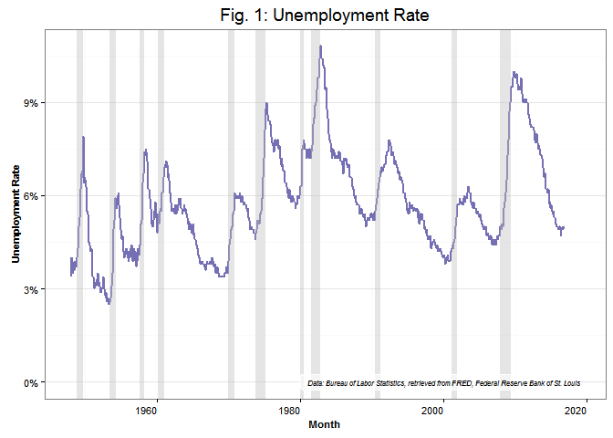 

Controversy over the accuracy of the unemployment rate statistic mostly stems from a concern over the determination of who is to be included in the labor force, and the fact that there is a declining labor force participation rate. The labor force is the number of people employed plus people who are unemployed and actively seeking work. The labor force participation rate is the labor force divided by the civilian non-institutional working age population. This is the measure often pointed to by critics as evidence that the official unemployment rate is understating the distress in the labor market.

Consider how participation in the labor force has changed over time in Fig. 2 below. The labor force participation rate peaked at 68.1 percent in July of 1997. It has been falling ever since and currently the rate is down to 62.8 percent. This is a decline of 5.3 percent points from the peak to today. The rate reached as low as 62.3 percent this last January, the lowest labor participation rate in forty years. Additionally, this means that 37.2 percent of the civilian non-institutionalized working age population does not have a job nor are they actively searching for a job. The drop in the labor force is a cause for concern. After all, does this not indicate that people are dropping out of the labor market and suggest a weakness in the economy that is masked by the official unemployment rate?

A challenge to this view is that labor force participation may decline for other reasons than discouragement over job prospects. People can leave the labor force because they no longer want a job, perhaps because they are retiring. Many people may want a job, but this includes those who have not searched for a job in over a year, those not available to work now, and marginally attached workers. Workers that want a job and are available for work now, but who are unemployed for various reason, are marginally attached. This includes those who are discouraged over job prospects, but also those who are out of the workforce due to school or training, illness or disability, or family responsibilities. There are many reasons why people may not be actively looking for work, so it makes sense not to include them in the labor force or the headline unemployment rate. 

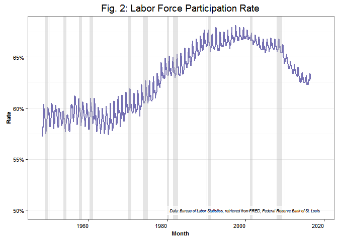 

The economist Stephen Moore, a top advisor to Donald Trump in fact, has argued that the drop in labor force participation rate, at least among millennials, is the result of policy mistakes under the Obama Administration. About the decline in labor force participation he says:

> This is partially explained by baby boomers retiring. But the largest reduction in the workforce has been among the millennials. Today the labor force participation rate for the 16 to 24 age group is 55.2 percent, down from 60.8 percent a decade ago and more than 66 percent back in the late 1990s. We're headed toward becoming Greece, where half the young people don't work. [3]

We can asses Moore's claims. Labor force participation trends are available for different age groups, so we can compare the rates for the age groups 16 to 19, 20 to 24, 25 to 54, and 55 years and over. For the youngest group, labor force participation has fallen from 52.2 percent in 1996 to an astoundingly low 35.6 percent in 2016. For those age 20 to 24, the rate has fallen from 76.8 percent to 70.6 percent over the last twenty years. Though still lower, the drop for the 25 to 54 age group only declined from 83.8 percent to 81.3 percent. For those 55 years and over the labor force participation rate actually increased from 30.3 percent to 40.1 percent, although that increase preceded the 2008 recession and the rate has been basically flat in the years since. The changing pattern across age groups shows the decline is most dramatic the younger one is on the scale. Also the variability in the rate, in terms of seasonal fluctuations, is a significant feature of the younger age groups.

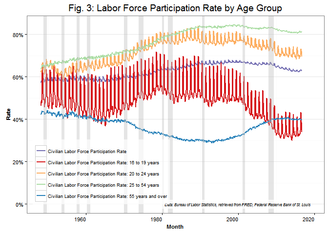 

### Population

Moore's assessment that millennials are experiencing the largest reduction in labor force participation is not incorrect, as we can see this trend in the chart above, however I think the way he phrases the issue can result in an ambiguous understanding of it. When he says that the decline in labor force participation is partially explained by the retirement of baby boomers and next suggests the largest reduction has been experienced by millennials, Moore makes it sound as if millennials outweigh baby boomers in the overall decline of labor force participation. This is not necessarily the case because different age groups do not constitute equal shares of the total population or total labor force. For example, even if millennials as a group have seen the sharpest decline, the big reduction in this group may still only be a small fraction of the total decline if millennials are a small fraction of the population. Let's take a look at the population by age group. 

Consider Fig. 4, an area chart that shows the share of the population composed by different age groups over time. In this chart we can observe how the population has grown over time and how each age group contributes, and it appears that over the last decade or so the total population has grown at a steady pace, but the only group that has contributed significantly to that growth are those aged 55 years and older. A closer look at the change in population between 1996 and 2016 can be seen in Fig. 5. This waterfall chart shows how each age group contributed to the total difference, with those 55 years and over growing by more than 36 million. The eldest Americans are responsible for 69 percent of the population growth in the last 20 years. Fig. 6 shows how the population share for each age group has changed between 1996 and 2016. As expected, those aged 55 years and over rose from 26.3 percent in 1996 to 35.2 percent in 2016, an increase of almost 9 percentage points in population share. Those aged 18 to 24 decrease in share by 1 percentage point, making up 15.2 percent of the working age population in 2016.   

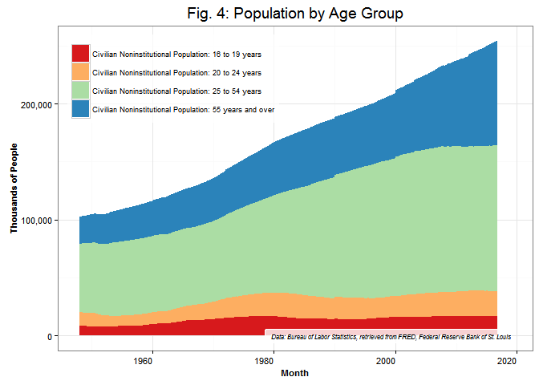 

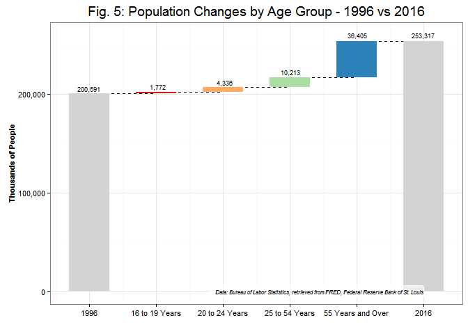 

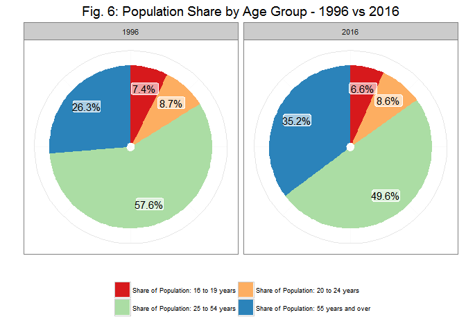 

### In and Out of the Labor Force

Population is only the denominator of the participation equation, we also need to consider the numerator, labor force. As with the population analysis, I have provided three charts below which break out labor force changes over time by age group, an area chart, waterfall chart, and pie charts respectively. From Fig. 7 we can see that the labor force has increased steadily over time until the Great Recession caused a slight dip and subsequent slower rate of growth compared to the population. This pattern is in line with an increasing population but declining labor force participation rate. Growth in the labor force since 1996 was been dominated again by those aged 55 years and over, increasing by about 19.7 million as evidenced by Fig. 8. This makes sense, given that labor force is subset of the population, so large shifts in population demographics will also be reflected in the labor force. 

It should be noted that the number of those aged 16 to 19 actually declined in absolute terms by about 1.9 million. This roughly balances out with the increase of 1.9 million in the 20 to 24 age group, so millennials have the same number participating the labor force as they did twenty years ago, despite a larger population. We can see in Fig. 9 that the share of the total labor force belonging to the 55 and older age group has almost doubled since 1996, growing from 11.9 percent to 22.4 percent. While the eldest Americans saw big increases, those 16 to 19 decline in share, going from 5.8 percent to 3.7 percent. This is indeed a drop, but a fairly small one from a relatively small starting point. We are starting to see that the impact from millennials may have been exaggerated by Moore, and the impact from baby boomers downplayed. To be fair, those over 55 years old have not contributed to a net decline in the labor force rate in the last twenty years, so it's easy to misconstrue the impact from this group. Also, this does not mean we shouldn't be concerned about the decline of millennials in the workforce, since this could indicate distress and low opportunity for new entrants. I will consider some reasons why young people are participating in the labor market less a little later on.

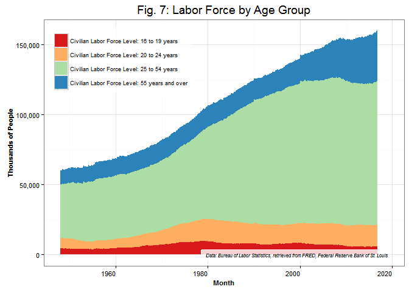 

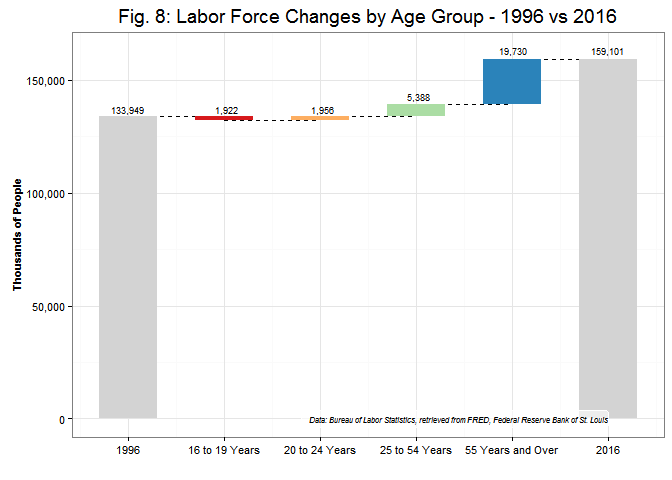 

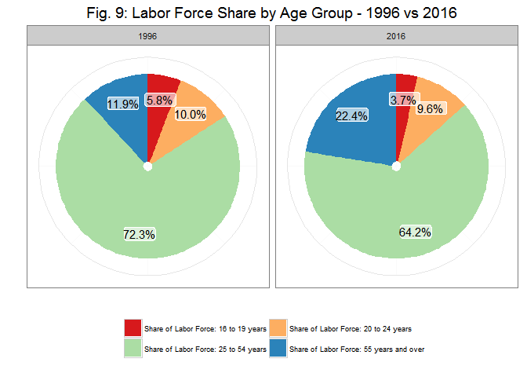 

The number of people not in the labor force has grown from 66.6 million in 1996 to 94.2 million in 2016, a significant jump. We can observe in Fig. 10 a steadily growing pool of people who are out of the labor force, but there is a sharp increase in the trend since about the year 2000. This area chart also illustrates how the 55 and over age group has generally had the larger share of those not in the labor force, where for population and labor force the dominant group is the 25 to 54 year olds. The pie charts in Fig. 12 indicate that the share of those not in the labor force has been fairly stable over time across the age groups, with the 55 and over crowd only growing from 55.2 percent in 1996 to 56.7 percent in 2016. This entails that the eldest Americans will have the largest share of the increase between those years as well. We can see that to be the case in Fig. 11 where the number those 55 years and older who are not in the labor force grew by 16.7 million in the last 20 years, a good 60 percent of the share in total growth. In contrast, those out of the workforce between the ages 16 and 24 grew by 6.1 million people. This is still a high number that should concern us, but clearly baby boomers retiring is the overwhelming factor in the growth of that part of the population not seeking a job.

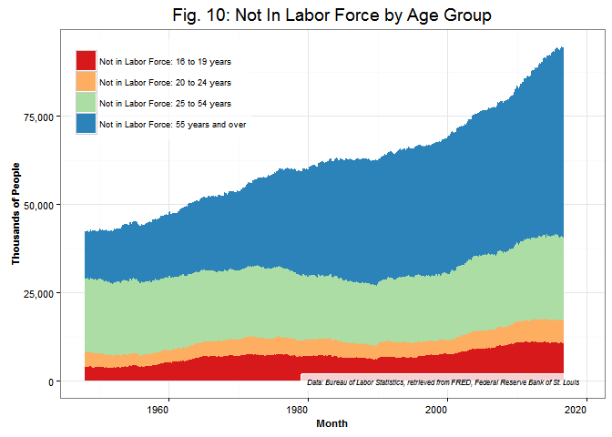 

 

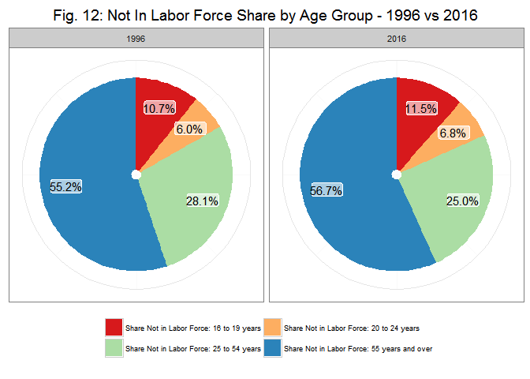 

### Baby Boomers and Generational Accounting

Baby boomers are Americans who were born during the high birth rate post WWII years. The massive amount of babies born between 1946 and 1964 means that people ranging from 52 to 70 years old today compose a significant share of the population. This points to a growing ratio of retirees to workers in the future. There are currently 46 million Americans who are 65 years or older. This is estimated to double by the years 2060, with this age group's share of the population growing from 15 percent to 24 percent in that time [4]. This is sure to weigh heavy on the labor force participation rate and push it lower for many years to come. 

One of the more obscure presidential candidates in 2016 is Laurence Kotlikoff. He is better known in the field of economics for proposing the generational accounting approach for understanding the national debt. The way we look at the national debt right now, currently tallied at 19.8 trillion dollars, is essentially backwards, whereas generational accounting considers future promised outlays against future projected revenues. This view makes the assumption that entitlement programs such as Medicare and Social Security, in which a tax on the current income of workers is transferred to finance current beneficiaries, carry with them implicit guarantees that these workers are paying into a system that will provide the same benefits to them in their future. The generational accounting approach therefore treats these future promises the same as if the federal government had issued bonds to cover the amount of the payroll taxes going to Social Security and Medicare. If the national debt were viewed this way, Laurence Kotlikoff argues it would be an astounding 199 trillion dollars [5].

The generational accounting approach is controversial. Making long term forecasts is not something that economists are all that good at, especially when politics is deeply intertwined. Regardless, our future demographics is much more certain, the baby boomers are aging, and this will have deep implications for the national debt. Medicare and Social Security outlays are increasing at a steep pace, as can be seen in Fig. 13. There is no indication that this trend will abate, and the growth of these expenses may very well accelerate in the coming decades. For these reasons I believe that we should take the generational accounting approach seriously. 

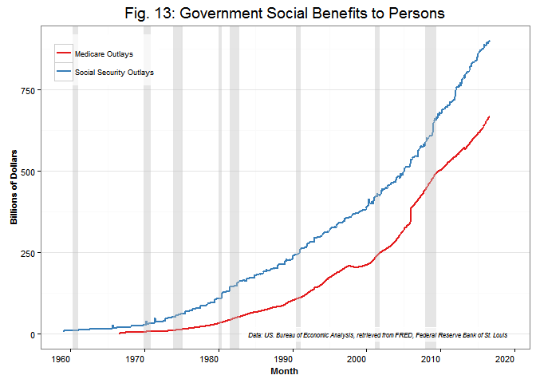 

### Millennials and College Enrollment

While the baby boomers and older generations are the largest cohort of those people leaving the labor force, millennials are partaking less in the labor force than those their age were two decades ago. As I mentioned earlier the participation rates for ages 16 to 19 decreased from 52.2 to 35.6 percent, while for ages 20 to 24 the decline was more modest, going from 76.8 to 70.6 percent. If we combine these cohorts we see a drop of 10.5 percentage points between 1996 and 2016. This is an issue of significant concern, because even though they are a smaller subset of the population, the phenomenon of young people not entering the workforce has the potential to be damaging to everyone's economic future. 

The youngest working age Americans, 16 to 19, clearly participate in the labor force the least, but the participation rate doubles for 20 to 24 year olds. Also we see the highest seasonal fluctuations in participation the younger the group. These facts suggest that the numbers we are seeing may be heavily influenced by high school and college attendance. Obviously, high school students typically graduate at age 18, and then many students will enter college for two, four, or even more years. Changes in the rates of college attendance could potentially explain some of the drop in the labor force participation rates for millennials, so this relationship is worth investigating.

Fig. 14 illustrates the change in college enrollment rates between 1970 and 2014 for those aged 16 to 24. The rate has been rising steadily over time, hitting a peak of 42 percent in 2011 and maintaining 40 percent in 2013 and 2014.  This trend appears to correlate with the decline in the labor force data, and one could make a fairly confident claim that there is a direct causal relationship between college enrollment rates and labor force participation rates. After all, time spent on obtaining an education would have an obvious opportunity measured in time spent working. That is precisely why we see such large seasonal fluctuations for labor force participation in teenagers and young adults , because many are only available for work in the summer when school is not in session. 

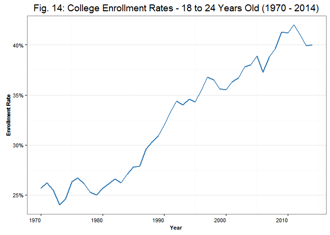 

By building a simple linear regression model using total college enrollment as the independent variable and labor force participation as the dependent variable I am able to measure the correlation between these rates. Fig. 15 is a scatter plot depicting this relationship between the years 1996 to 2014, with a downward sloping regression line surrounded by shaded confidence intervals. The downward slope means that there is a negative relationship between the variables, meaning higher college enrollment rates are associated with lower workforce participation rates. The adjusted R-squared, or coefficient of determination, shows how much the movement in one variable explains the other, and at 89 percent, the correlation between these two rates is very high. The slope of the line suggests that for every 1 percent increase in college enrollment there is a 1.9 percent decrease in labor force participation rate. Although it's likely that there are workers who are simultaneously students, and we cannot assume complete exclusivity, the combined college enrollment rate and labor force participation rate was 95 percent in 2014 for millennials. This really paints a much different picture of the situation than what Stephen Moore described, with his worries over bad government policy and the minimum wage pricing young people out of the labor market. 

While this regression model demonstrates a strong correlation, it should we pointed out that the linear relationship breaks down if we include the data from 1970 to 1995. The adjusted R-squared drops to 42 percent, but this statistic is no longer appropriate since the data now exhibit a nonlinear arc pattern as shown in Fig. 16. This is because the data in the earlier years shows that lower and more stable college enrollment rates were associated with rising labor force participation in the 16 to 24 age group. I did not investigate the drivers of labor force participation for the years prior to 1996, however I think it's safe to make a normative judgment that if we are going to have a lower labor force participation rate for younger people it is actually a good thing if it's because a greater percentage are going to college, rather than simply idle. In this light, the current and future employment situation for millennials in the 2010s is better than it was in the 1970s, at least if the college education one chooses to pursue has a positive return on investment.

 

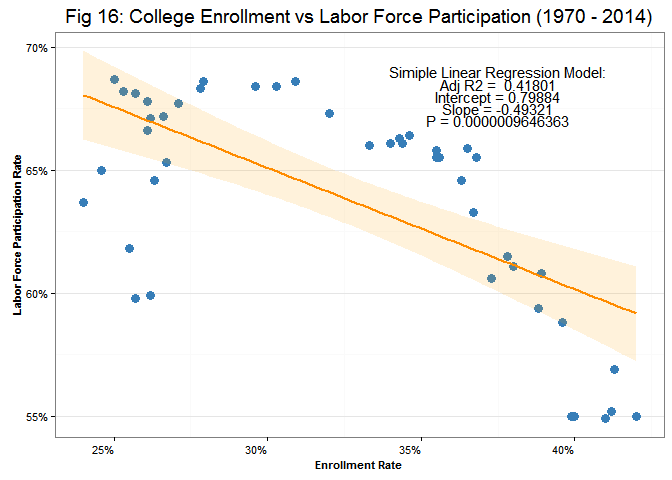 

### The Other Unemployment Rates

This brings us back to the unemployment rate. Is the current rate of 5.0 "such a phony number"[2], as Donald Trump has said many times in the last couple of years? Is the real rate 18, 19, 20, 21, 25, or maybe even as high as 42 percent? Trump has at different times claimed that unemployment is all of these different rates.

The unemployment rate is not a phony number, and the real unemployment rate is not somewhere between 18 and 42 percent. Donald Trump is wrong about this. The only plausible way to argue that the unemployment rate is so much higher than the official number is to change the definitions for who should be include in the labor force. Even if we were to include the entire working age population in the labor force, the unemployment rate would be 37.2 percent on average for 2016, proving that Trump's upper limit of 42 percent is incredibly farfetched. Obviously, it does not make sense to add everyone currently not in the labor force to the rolls of the unemployed, since this would mean including those enrolled in college, retirees, stay-at-home parents, and everyone who is otherwise not looking for a job. 

What about Trump's lower limit of 18 percent, is this realistic? Again, it depends on how you define unemployment. The contemporary debate over this number tends to turn on how one factors in the amount of people who have left the labor force because they are discouraged with job prospects and stopped looking for a job. This is a category of people who want a job, haven't been able to land one, and are no longer actively searching, so it makes sense to consider them when evaluating the health of the labor market. 

One of the more interesting analyses I have seen on this uses labor force status flows in an attempts to demarcate people leaving the labor force as either retirees or discouraged workers [6]. This data measures how people move in an out of different labor force statuses, such as how many have moved from employed to unemployed, from employed to not in the labor force, and from unemployed to not in the labor force. The analysis makes an assumption that those who move directly from being employed to being not in the labor force, therefore skipping over the unemployed category, are generally retirees. The analysis also makes an assumption that those who move from the ranks of the unemployed to being not in the labor force are generally discouraged workers. There is good intuitions behind these assumptions, as it makes sense that people who are unemployed and searching for a job subsequently stop their search without finding a job would be discouraged. Based on these two assumptions, the labor force status flows are charted over time and this reveals that during the Great Recession the main reason for the decline in labor force participation was due to discouraged workers. Later in the recovery, the impact from retirees has grown and the impact from discouraged workers has abated. 

There is definitely some good intuition behind these assumptions, but how do we know that these assumptions are correct and that every person who goes from being unemployed to not in the labor force is necessarily a discouraged worker? It turns out that analyzing labor force status flows data using assumptions may be an unnecessarily circumspect a way to view the data. The BLS actually publishes more than one unemployment rate, in fact it publishes six, and one of those alternative rates is the rate for those unemployed plus discouraged workers. The six unemployment rates are called U1 through U6, and as the label names gets higher the definition is more inclusive and produces a higher rate. Fig. 17 illustrates the different unemployment rates below, with U3 being the official definition that typically gets reported on and discussed. As you can see, the rate that includes discouraged workers, U4, is very close to the U3 rate, so does not indicate a dramatically higher rate than what is often the focus. Furthermore, even when all those marginally attached to the workforce are included, as the U5 definition does, the rate is not materially different than U3. 

The most inclusive definition is U6, and this includes all the people in U5 plus underemployed workers, which are those workers who are working part time but would like to work more. The U6 rate is significantly higher than the U3 rate, currently standing at 9.7 percent and almost double what is typically promoted as the unemployment rate. Does this mean Donald Trump is correct, that the official rate is phony? Obviously the U6 rate is well below Trump's lower limit of 18 percent, and about a quarter of his upper limit of 42 percent, so his preposterous and mercurial claims should betray any semblance of credibility to a keen observer. Besides that, there is absolutely no controversy with the U3 definition being the official unemployment rate, as this has been the standard way of reporting on the phenomenon for a long time and is therefore perfectly appropriate for historical comparisons and policy considerations. The U6 rate is currently higher than we would want, and above previous cycle minimums, so certainly this should be part of the discussion, but this does not make the U3 rate phony.

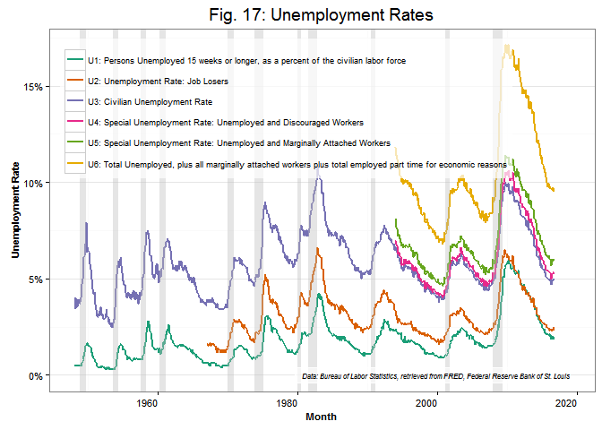 

### Conclusion

These days there are high levels of distrust in our institutions, distrust of the political establishment, distrust of academics, distrust of economists and economic data. Donald Trump has tapped into that distrust, and of course he has also fueled that distrust. My goal here is to demonstrate that the unemployment and labor force participation rates are valuable pieces of data which offer true insight into our economic situation. There are always challenges with statistical data to be sure, but claiming the numbers are phony and spouting that the real rate of unemployment is four, six, maybe eight times higher is not helpful. It's very difficult to have confidence that sound economic decisions will be made by someone who seeks to elevate blatantly inaccurate data in order to ridicule real facts. 

Some might read this analysis and think that it works as far as it goes, but still believe that the data itself is unreliable, or manipulated in some way, therefore rendering the whole endeavor suspect. This is cynical, maybe even a little nihilistic, especially since the economic data is widely used and in high demand. Markets move when the employment report is released, and forecasters try to anticipate the future of job growth using econometric models that relate this to other data. I have used unemployment and labor force data in a professional context, and this experience gives me confidence in the data because I have put it to practical use and found it to provide valuable insights. I have related unemployment to sales and churn data, correlating the data by geography, the cadence of seasonal fluctuations, and even longer and more irregular cyclical movements. The coherence and practicality of economic data substantiates its truthfulness. To be cynical of it in a professional context would be imprudent, and this consideration should overrule rhetorical arguments with transparent political motivations.

### Works Cited

1. Perez, Tom. U.S. Department of Labor Blog. October Jobs Report Shows How Far We’ve Come. [Online] November 4, 2016. [Cited: November 4, 2016.] https://blog.dol.gov/2016/11/04/october-jobs-report-shows-how-far-weve-come/.

2. Watch Donald Trump Stumble Over The Unemployment Rate Again And Again. The Huffingting Post. [Online] 2016. [Cited: November 4, 2016.] http://www.huffingtonpost.com/entry/donald-trump-unemployment-rate_us_57714e7ce4b0dbb1bbbb3c01.

3. Moore, Stephen. 100 Million Americans Not Working! Townhall. [Online] July 7, 2015. [Cited: October 15, 2016.] http://townhall.com/columnists/stephenmoore/2015/07/07/100-million-americans-not-working-n2022050.

4. Mather, Mark. Fact Sheet: Aging in the United States. Population Reference Bureau. [Online] January 2016. [Cited: October 30, 2016.] http://www.prb.org/Publications/Media-Guides/2016/aging-unitedstates-fact-sheet.aspx.

5. Kotlikoff, Laurence. Bankrupting Our Children. Laurence Kotlikoff for President 2016. [Online] 2016. [Cited: October 30, 2016.] https://kotlikoff2016.com/bankrupting-our-children/.

6. Majority, Great Vocal. What drives the low Labor Force Participation Rate? YouTube. [Online] January 15, 216. [Cited: October 30, 2016.] https://www.youtube.com/watch?v=amLdDRdWIV4.

### Data Sources

US. Bureau of Labor Statistics, Persons Unemployed 15 weeks or longer, as a percent of the civilian labor force [U1RATE], retrieved from FRED, Federal Reserve Bank of St. Louis; https://fred.stlouisfed.org/series/U1RATE, October 7, 2016.

US. Bureau of Labor Statistics, Unemployment Rate: Job Losers [U2RATE], retrieved from FRED, Federal Reserve Bank of St. Louis; https://fred.stlouisfed.org/series/U2RATE, October 7, 2016.

US. Bureau of Labor Statistics, Civilian Unemployment Rate [UNRATE], retrieved from FRED, Federal Reserve Bank of St. Louis; https://fred.stlouisfed.org/series/UNRATE, October 7, 2016.

US. Bureau of Labor Statistics, Special Unemployment Rate: Unemployed and Discouraged Workers [U4RATE], retrieved from FRED, Federal Reserve Bank of St. Louis; https://fred.stlouisfed.org/series/U4RATE, October 7, 2016.

US. Bureau of Labor Statistics, Special Unemployment Rate: Unemployed and Marginally Attached Workers [U5RATE], retrieved from FRED, Federal Reserve Bank of St. Louis; https://fred.stlouisfed.org/series/U5RATE, October 7, 2016.

US. Bureau of Labor Statistics, Total unemployed, plus all marginally attached workers plus total employed part time for economic reasons [U6RATE], retrieved from FRED, Federal Reserve Bank of St. Louis; https://fred.stlouisfed.org/series/U6RATE, October 7, 2016.

US. Bureau of Labor Statistics, Civilian Labor Force Participation Rate [LNU01300000], retrieved from FRED, Federal Reserve Bank of St. Louis; https://fred.stlouisfed.org/series/LNU01300000, October 7, 2016.

US. Bureau of Labor Statistics, Civilian Labor Force Participation Rate: 16 to 19 years [LNS11300012], retrieved from FRED, Federal Reserve Bank of St. Louis; https://fred.stlouisfed.org/series/LNS11300012, October 7, 2016.

US. Bureau of Labor Statistics, Civilian Labor Force Participation Rate: 20 to 24 years [LNU01300036], retrieved from FRED, Federal Reserve Bank of St. Louis; https://fred.stlouisfed.org/series/LNU01300036, October 7, 2016.

US. Bureau of Labor Statistics, Civilian Labor Force Participation Rate: 25 to 54 years [LNU01300060], retrieved from FRED, Federal Reserve Bank of St. Louis; https://fred.stlouisfed.org/series/LNU01300060, October 7, 2016.

US. Bureau of Labor Statistics, Civilian Labor Force Participation Rate: 55 years and over [LNU01324230], retrieved from FRED, Federal Reserve Bank of St. Louis; https://fred.stlouisfed.org/series/LNU01324230, October 8, 2016.

US. Bureau of Labor Statistics, Civilian Labor Force [CLF16OV], retrieved from FRED, Federal Reserve Bank of St. Louis; https://fred.stlouisfed.org/series/CLF16OV, October 7, 2016.

US. Bureau of Labor Statistics, Civilian Labor Force Level: 16 to 19 years [LNS11000012], retrieved from FRED, Federal Reserve Bank of St. Louis; https://fred.stlouisfed.org/series/LNS11000012, October 7, 2016.

US. Bureau of Labor Statistics, Civilian Labor Force Level: 20 to 24 years [LNS11000036], retrieved from FRED, Federal Reserve Bank of St. Louis; https://fred.stlouisfed.org/series/LNS11000036, October 7, 2016.

US. Bureau of Labor Statistics, Civilian Labor Force Level: 25 to 54 years [LNS11000060], retrieved from FRED, Federal Reserve Bank of St. Louis; https://fred.stlouisfed.org/series/LNS11000060, October 7, 2016.

US. Bureau of Labor Statistics, Civilian Labor Force Level: 55 years and over [LNS11024230], retrieved from FRED, Federal Reserve Bank of St. Louis; https://fred.stlouisfed.org/series/LNS11024230, October 7, 2016.

US. Bureau of Labor Statistics, Civilian Noninstitutional Population [CNP16OV], retrieved from FRED, Federal Reserve Bank of St. Louis; https://fred.stlouisfed.org/series/CNP16OV, October 7, 2016.

US. Bureau of Labor Statistics, Civilian Noninstitutional Population - 16 to 19 years [LNU00000012], retrieved from FRED, Federal Reserve Bank of St. Louis; https://fred.stlouisfed.org/series/LNU00000012, October 7, 2016.

US. Bureau of Labor Statistics, Civilian Noninstitutional Population - 20 to 24 years [LNU00000036], retrieved from FRED, Federal Reserve Bank of St. Louis; https://fred.stlouisfed.org/series/LNU00000036, October 7, 2016.

US. Bureau of Labor Statistics, Civilian Noninstitutional Population - 25 to 54 years [LNU00000060], retrieved from FRED, Federal Reserve Bank of St. Louis; https://fred.stlouisfed.org/series/LNU00000060, October 7, 2016.

US. Bureau of Labor Statistics, Civilian Noninstitutional Population - 55 years and over [LNU00024230], retrieved from FRED, Federal Reserve Bank of St. Louis; https://fred.stlouisfed.org/series/LNU00024230, October 7, 2016.

US. Bureau of Economic Analysis, Personal current transfer receipts: Government social benefits to persons: Medicare [W824RC1], retrieved from FRED, Federal Reserve Bank of St. Louis; https://fred.stlouisfed.org/series/W824RC1, October 26, 2016.

US. Bureau of Economic Analysis, Personal current transfer receipts: Government social benefits to persons: Social security [W823RC1], retrieved from FRED, Federal Reserve Bank of St. Louis; https://fred.stlouisfed.org/series/W823RC1, October 30, 2016.

Digest of Education Statistics, Percentage of 18- to 24-year-olds enrolled in degree-granting postsecondary institutions, by level of institution and sex and race/ethnicity of student: 1970 through 2014 [Table 302.60], retrieved from National Center for Education Statistics; http://nces.ed.gov/programs/digest/d15/tables/dt15_302.60.asp?current=yes, October 30, 2016.

### Other Credits

I must give credit to James Keirstead because I borrowed his design for watefall charts using R. (https://gist.github.com/jkeirstead)

### Appendix

#### Table of Unemployment and Labor Force Participation Rates

| Month          | Unemployment Rate | Labor Force Participation Rate | LFP: 16 to 19 Years | LFP: 20 to 24 Years | LFP: 25 to 54 Years | LFP: 55 Years and Over |
|:-------------------|:-------------------:|:-------------------:|:-------------------:|:-------------------:|:-------------------:|:-------------------:|
|1996|5.41%|66.8%|52.2%|76.8%|83.8%|30.3%|
|1997|4.94%|67.1%|51.6%|77.6%|84.1%|30.9%|
|1998|4.5%|67.1%|52.8%|77.5%|84.1%|31.3%|
|1999|4.22%|67.1%|52%|77.5%|84.1%|31.8%|
|2000|3.97%|67.1%|52%|77.8%|84%|32.4%|
|2001|4.74%|66.8%|49.6%|77.1%|83.7%|33.2%|
|2002|5.78%|66.6%|47.4%|76.4%|83.3%|34.5%|
|2003|5.99%|66.2%|44.5%|75.4%|83%|35.7%|
|2004|5.54%|66%|43.9%|75%|82.8%|36.2%|
|2005|5.08%|66%|43.7%|74.6%|82.8%|37.2%|
|2006|4.61%|66.2%|43.7%|74.6%|82.9%|38%|
|2007|4.62%|66%|41.3%|74.4%|83%|38.6%|
|2008|5.8%|66%|40.1%|74.3%|83.1%|39.4%|
|2009|9.28%|65.4%|37.5%|73%|82.6%|40%|
|2010|9.61%|64.7%|34.9%|71.4%|82.2%|40.2%|
|2011|8.93%|64.1%|34.1%|71.3%|81.6%|40.2%|
|2012|8.08%|63.7%|34.3%|70.9%|81.5%|40.4%|
|2013|7.37%|63.3%|34.5%|70.7%|81%|40.3%|
|2014|6.17%|62.9%|34%|70.8%|80.9%|40%|
|2015|5.28%|62.6%|34.3%|70.7%|80.8%|39.9%|
|2016|4.91%|62.8%|35.6%|70.6%|81.3%|40.1%|

#### Table of Civilian Non-Institutional Population by Age Group (Thousands of People)

| Month          | Civilian Population | Pop: 16 to 19 Years | Pop: 20 to 24 Years | Pop: 25 to 54 Years | Pop: 55 Years and Over |
|:-------------------|:-------------------:|:-------------------:|:-------------------:|:-------------------:|:-------------------:|
|1996|200,591|14,934|17,409|115,506|52,742|
|1997|203,133|15,365|17,442|116,832|53,494|
|1998|205,220|15,644|17,593|117,450|54,533|
|1999|207,753|16,040|17,968|118,198|55,548|
|2000|212,577|15,912|18,311|120,656|57,697|
|2001|215,092|15,929|18,877|121,604|58,683|
|2002|217,570|15,994|19,348|122,077|60,151|
|2003|221,168|16,096|19,802|123,289|61,981|
|2004|223,357|16,222|20,197|123,410|63,527|
|2005|226,083|16,398|20,276|124,175|65,233|
|2006|228,815|16,678|20,265|124,884|66,988|
|2007|231,867|16,982|20,427|125,696|68,761|
|2008|233,788|17,075|20,409|125,652|70,652|
|2009|235,801|17,044|20,524|125,565|72,668|
|2010|237,829|16,901|21,047|125,290|74,591|
|2011|239,618|16,774|21,423|124,704|76,716|
|2012|243,284|16,984|21,799|124,314|80,187|
|2013|245,679|16,788|22,052|124,406|82,434|
|2014|247,947|16,633|22,080|124,511|84,724|
|2015|250,801|16,619|21,971|125,109|87,102|
|2016|253,317|16,706|21,745|125,719|89,147|

#### Labor Force by Age Group (Thousands of People)

| Month          | Civilian Labor Force | LF: 16 to 19 Years | LF: 20 to 24 Years | LF 25 to 54 Years | LF: 55 Years and Over |
|:-------------------|:-------------------:|:-------------------:|:-------------------:|:-------------------:|:-------------------:|
|1996|133,951|7,809|13,378|96,788|15,974|
|1997|136,301|7,936|13,536|98,280|16,551|
|1998|137,680|8,255|13,635|98,724|17,064|
|1999|139,380|8,336|13,934|99,420|17,689|
|2000|142,586|8,276|14,249|101,393|18,669|
|2001|143,769|7,911|14,563|101,813|19,489|
|2002|144,856|7,587|14,778|101,718|20,779|
|2003|146,500|7,166|14,928|102,315|22,101|
|2004|147,380|7,114|15,150|102,110|23,009|
|2005|149,289|7,160|15,122|102,759|24,254|
|2006|151,409|7,278|15,111|103,551|25,468|
|2007|153,123|7,019|15,209|104,341|26,554|
|2008|154,322|6,856|15,180|104,420|27,866|
|2009|154,188|6,388|14,975|103,775|29,050|
|2010|153,885|5,911|15,029|102,927|30,020|
|2011|153,624|5,730|15,271|101,750|30,878|
|2012|154,972|5,820|15,462|101,256|32,439|
|2013|155,394|5,782|15,591|100,786|33,230|
|2014|155,904|5,649|15,638|100,760|33,858|
|2015|157,126|5,703|15,522|101,150|34,751|
|2016|159,115|5,888|15,333|102,176|35,704|

#### Not in the Labor Force by Age Group (Thousands of People)

| Month          | Not in Labor Force | NILF: 16 to 19 Years | NILF: 20 to 24 Years | NILF 25 to 54 Years | NILF: 55 Years and Over |
|:-------------------|:-------------------:|:-------------------:|:-------------------:|:-------------------:|:-------------------:|
|1996|66,639|7,125|4,031|18,718|36,768|
|1997|66,832|7,429|3,905|18,552|36,944|
|1998|67,540|7,388|3,958|18,725|37,469|
|1999|68,373|7,704|4,033|18,778|37,859|
|2000|69,991|7,636|4,062|19,263|39,028|
|2001|71,324|8,018|4,314|19,791|39,194|
|2002|72,714|8,407|4,570|20,358|39,372|
|2003|74,668|8,930|4,874|20,974|39,881|
|2004|75,977|9,108|5,047|21,300|40,518|
|2005|76,793|9,238|5,154|21,416|40,979|
|2006|77,406|9,400|5,154|21,333|41,520|
|2007|78,744|9,963|5,218|21,355|42,207|
|2008|79,466|10,220|5,229|21,232|42,786|
|2009|81,612|10,656|5,550|21,790|43,618|
|2010|83,944|10,990|6,018|22,363|44,572|
|2011|85,994|11,045|6,153|22,954|45,837|
|2012|88,312|11,164|6,337|23,058|47,747|
|2013|90,286|11,005|6,461|23,620|49,203|
|2014|92,042|10,984|6,442|23,750|50,866|
|2015|93,674|10,916|6,449|23,959|52,352|
|2016|94,202|10,819|6,411|23,543|53,443|

